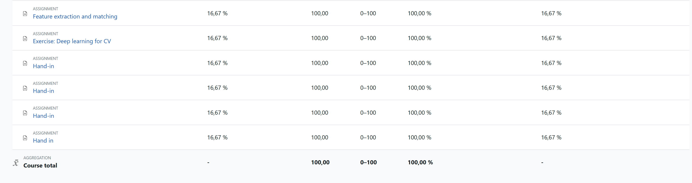

# Computer Vision Assignments

Below are CV assignment code from Lab2 to Lab7, main content is listed, full marks are gained (600/600), feel free to refer each report for more details:

## Lab2

* Harris corner detection
* Key Points Matching

## Lab3

* Binary Classification on 2D Point Clouds
* Image Classification on MNIST/CIFAR10

## Lab4

* Bag-of-words Classifier
* CNN-based Classifier

## Lab5

* Mean-shift Segmentation

## Lab6

* Object Tracking

## Lab7

* Structure from Motion(SfM)

* RANSAC